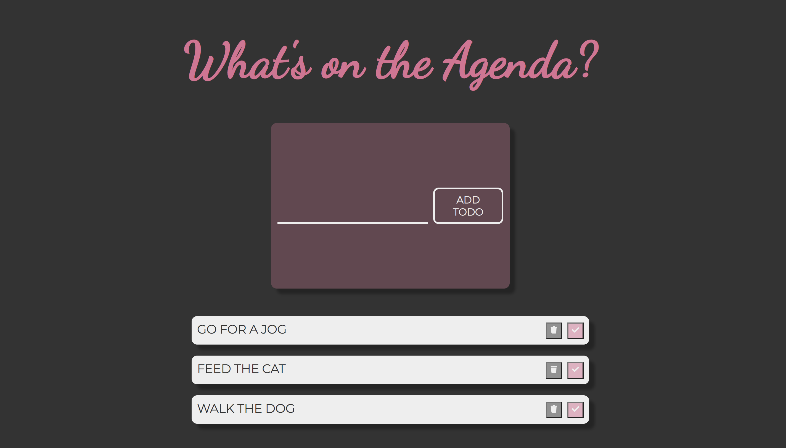
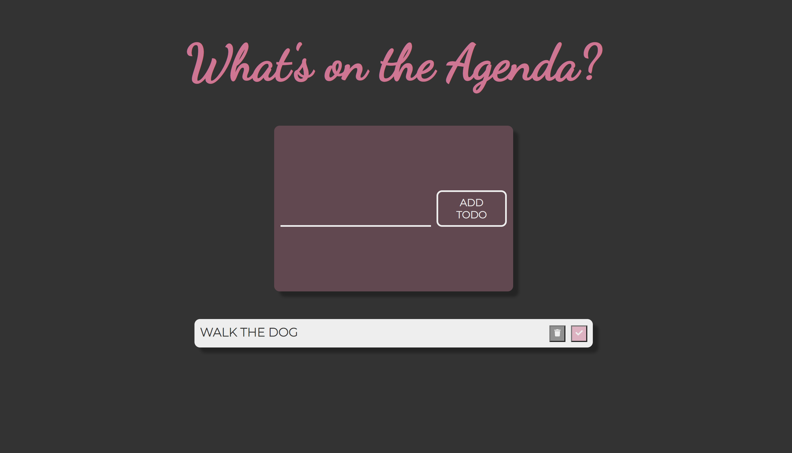

## About The App

This is a Todo application that allows one to add a todo to a list. Each list item is equipped with a complete and delete button. The data is preserve with each refresh due to local storage.

## Screenshots

## Technologies

- React || CSS

## Setup

- Download or clone the repository
- Run npm install
- Run npm start
